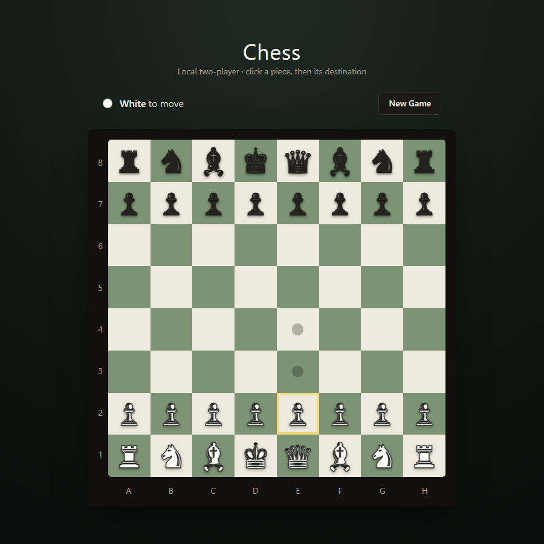

# Chess Engine (Java + React)

A chess engine built from scratch in Java — no game-logic libraries — designed around classic object-oriented principles, paired with a React + TypeScript web UI that plays against it live over a REST API. Two ways to see the same skills: open the class hierarchy for the OOP design, or open `web/` for the frontend.



## Object-Oriented Design

The core engine is the part built to show OOP fundamentals, not just "make chess work":

- **Abstraction** — `Piece` is an abstract base class defining the contract (`validMove`, `attacksSquare`, `isClear`) every piece must satisfy, without knowing anything about how any specific piece moves.
- **Inheritance** — `Pawn`, `Rook`, `Knight`, `Bishop`, `Queen`, `King` each extend `Piece` and implement only their own movement rules.
- **Polymorphism** — `Board` never asks "what type of piece is this?" It calls `piece.validMove(...)` and `piece.attacksSquare(...)` on the `Piece` reference and lets each subclass's override run — there's no `instanceof` chain or switch statement dispatching on piece type anywhere in the move-validation path.
- **Encapsulation** — piece color and identity are private, exposed only through accessors; `Board` owns all mutation of game state through a single `applyMove` entry point.
- **Single source of truth** — check, checkmate, and stalemate detection (`isInCheck`, `isCheckmate`, `isStalemate`) all compose from the same `hasLegalMoves`/`wouldBeInCheck` primitives, so the rules can't drift out of sync with themselves as the engine grows.
- **69 unit tests across 7 test classes** (JUnit 5) covering piece movement, path-blocking, and board state — proof the design was verified as it was built, not just eyeballed.

## React Frontend

The same engine is wired live to a React UI over HTTP — the browser never re-implements chess rules, it only renders state and asks the server "is this move legal?":

- Function components + hooks (`useState`/`useEffect`/`useCallback`) in TypeScript, no class components, no external state management library
- Component composition: `ChessBoard` → `Square` → `PieceGlyph`, each with a single responsibility (layout, per-square interaction/highlighting, piece rendering)
- A typed API client (`api.ts`) with shared request/response types (`types.ts`) instead of `any`-typed fetch calls
- Click-to-select → legal-move highlighting → click-to-move interaction, driven entirely by server responses (selecting a piece calls the API for its legal destinations; the client holds no chess logic of its own)
- Check, last-move, and game-over states all derived from one server-provided `GameState` object — no local/server state drift

## Features

- Full legal-move validation for all six piece types, including blocked-path detection for sliding pieces
- Check (`isInCheck`), checkmate (`isCheckmate`), and stalemate (`isStalemate`) detection — moves that would leave your own king in check are rejected before they're applied
- **Web UI**: click-to-move board with legal-move highlighting, check/last-move highlighting, and a checkmate/stalemate end screen
- **Terminal UI**: text move input (e.g. `E2 E4`) against a Unicode-boxed board — the same engine, no browser required

## Tech Stack

**Backend**
- Java 21, built with Maven
- [Javalin](https://javalin.io) — embedded REST API server
- Jackson — JSON serialization
- JUnit 5 for unit testing

**Frontend** (`web/`)
- React + TypeScript, built with Vite
- Tailwind CSS

## Getting Started

**Prerequisites:** JDK 21+, Maven, Node 18+

### Backend — API server (for the web UI)

```bash
mvn -DskipTests package
java -jar target/chess-server.jar
```

Starts the REST API on `http://localhost:7000`. Endpoints:

| Method | Path | Description |
|---|---|---|
| `POST` | `/api/games` | Start a new game |
| `GET` | `/api/games/{id}` | Get current board/turn/check state |
| `GET` | `/api/games/{id}/moves?x=&y=` | Legal destination squares for the piece at `(x, y)` |
| `POST` | `/api/games/{id}/move` | Body `{fromX, fromY, toX, toY}` — apply a move |

### Frontend — web UI

```bash
cd web
npm install
npm run dev
```

Opens at `http://localhost:5173`. Requires the API server above to be running (defaults to `http://localhost:7000`; override with a `VITE_API_BASE` env var).

### Backend — terminal version

```bash
mvn compile
java -cp target/classes Main
```

Moves are entered as `<from> <to>` using file (A–H) and rank (1–8), e.g.:

```
E2 E4
```

### Run the tests

```bash
mvn test
```

## Project Structure

| Class | Responsibility |
|---|---|
| `Piece` (abstract) | Shared piece state and the `validMove`/`attacksSquare` contract |
| `Pawn`, `Rook`, `Knight`, `Bishop`, `Queen`, `King` | Per-piece movement and attack rules |
| `Board` | Board state, rendering, move application, check/checkmate/stalemate logic |
| `Move` | Simple move representation (from/to coordinates) |
| `Color` | White/black enum |
| `GameState`, `Main` | Terminal game loop, move parsing, and input validation |
| `ApiServer` | Javalin REST API — routes and CORS |
| `GameSession` | Wraps `Board` with turn tracking and legal-move listing for the API |
| `GameStateDTO`, `PieceDTO`, `MoveRequest` | JSON request/response shapes |
| `IllegalMoveException` | Signals a rejected move back to the API layer |
| `web/src/` | React UI: board rendering, move selection, API client |

## Roadmap

Not yet implemented:

- Castling
- En passant
- Pawn promotion
- Move history / algebraic notation display
- Online multiplayer (currently local same-device play only, now via browser or terminal)
